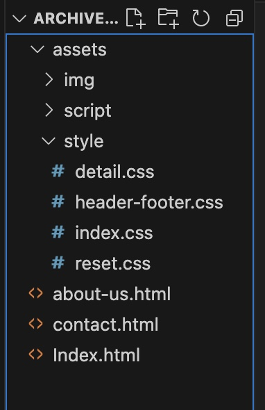

# I would like to introduce a web project that I did at MITT last month.
## what is the web project?
It is a web site to show how to use HTML and css to build a simple web site.
## Why did I make it? 
Actually, at the end of '**Introducing to web development**', my teacher Mr.Andre asked every student to create a web site. It represents what and how much I learned from the lesson.
## What considerations or decisions did I make while creating it?
As a prject assigned by my teacher, how I do it will affect the score in this subject. Therefore, all the knowledge I learned from the class should be used in the project, not only is the code proficiency important, but also some coding rules that I have to follow. For example:
- All files must be organized into different folders properly:
 
- and also there are some coding rules such as HTML structure:
```HTML
<!DOCTYPE html>   //document type
<head>    //HTML head will include some information for browsers
    <meta charset="utf-8">
    <link rel="stylesheet" href="tes.css">
</head>
<body>    //everything will be written in the body and shown to users.
    <header>    //useing HTML tags to structure everything.
        <div>
        </div>
    </header>
</body>
```
## What did I find challenging or interesting?
In this project, I practiced how to align every element properly. The most challenging part was using as simple, nested and readable code as possible to build a beautiful and modern website. Other than the challenge, there are also something very interesting. Such as when I resize the browser to a certain width, I will hide a navigation instead of appear a menu for navigation. It tooks me 30 minutes to achieve that, but it makes my web site more dinamic.


