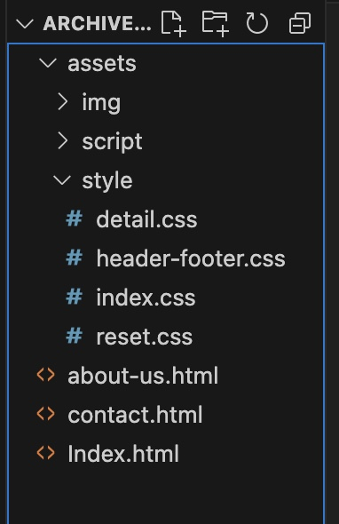
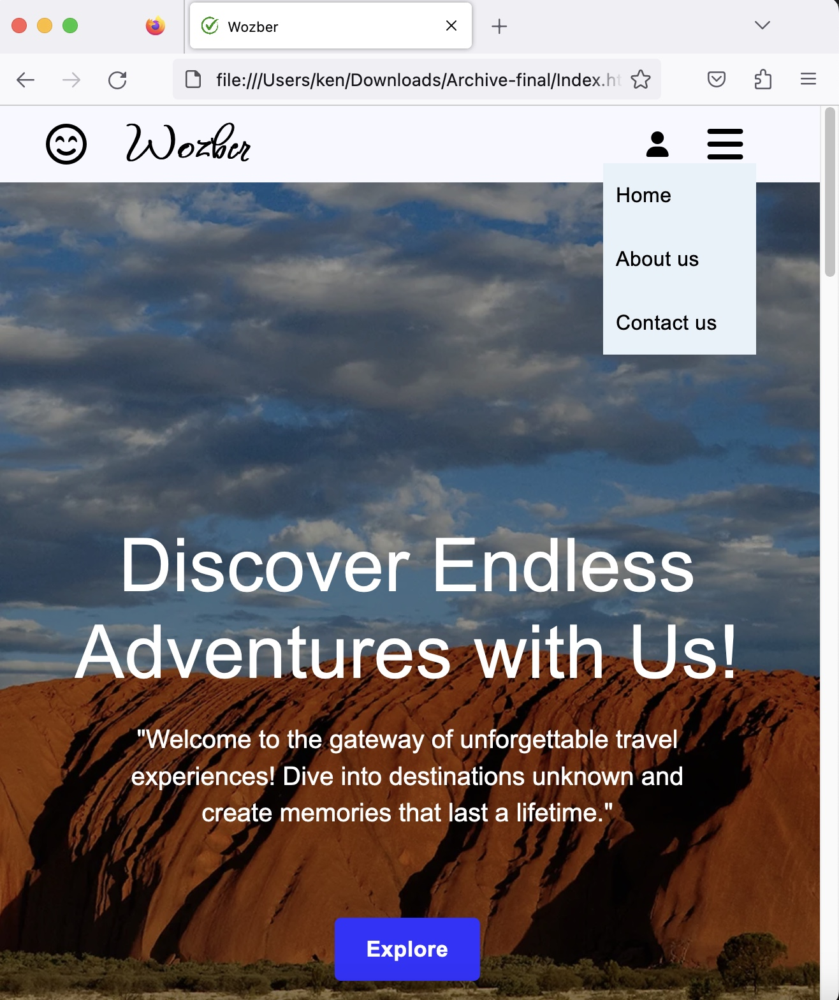

# I would like to introduce a web project that I did at MITT last month.

## what is the web project?
It is a travel agency website that demonstrates how to use HTML and CSS to build a modern website. This website is not the first one in my life, so it is beautiful and can be formally used for any travel agency.

## Why did I make it? 
Actually, at the end of the class of '**Introducing to web development**', my teacher Mr.Andre asked every student to create a website. He suggested us to find an example from online and mix our idea to build a new website. It represents what and how much I learned from the lesson. In addition, I refined many HTML and CSS skill details through this project and inspired me to pursue coding in website design in the future.

## What considerations or decisions did I make while creating it?
As a prject assigned by my teacher, how I do it will affect the score in this subject. Therefore, all the knowledge I learned from the class should be used in the project, not only is the code proficiency important, but also some coding rules that I have to follow. For example:
- All files must be organized into different folders properly:
  
 
- Website consistency: Since there are not only one page for the website, so the color and the alignment must be think carefully. 
- _And also there are specific coding rules I have to follow, particularly concerning HTML structure:_
```HTML
<!DOCTYPE html>   //document type
<head>    //HTML head will include some information for browsers
    <meta charset="utf-8">
    <link rel="stylesheet" href="tes.css">
</head>
<body>    //everything will be written in the body and shown to users.
    <header>    //useing HTML tags to structure everything.
        <div>   // div is a block child of header. 
        </div>
    </header>
</body>
```
## What did I find challenging or interesting?
In this project, I focus on  element alignment. The most challenging part was using as simple, nested and readable code as possible to build a beautiful, modern and neat website. Sometimes I have to test it in different web browsers to ensure my code works well on them, which is really boring and time-consuming.

Apart from the challenges, there ware also some very interesting aspects. Such as when I resized the browser to a certain width, I will hide a navigation instead of appear a menu for navigation. It took me 30 minutes to accomplish that, but it made my website more dynamic and interesting.
 

_this is can be achieved by following css:_
```CSS
@media screen and (max-width:768px) {
    .header-div span {
        display: none;
    }

    .menu span {
        display: block;
    }

    header .menu {
        display: flex;
    }
}
```

## What improvements would I make to it if you kept working on it? 
Currently, I still need to check online to achieve a ideal website design. If I keep working on website design, I am confident that I will definitely become more proficient in HTML and CSS coding, improve my problem solving skill and more creative in website design. It brings me a potential career growth in the ever-evolving field of web development.:grinning:
